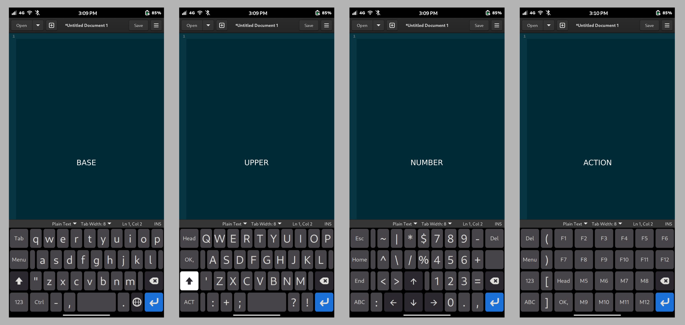
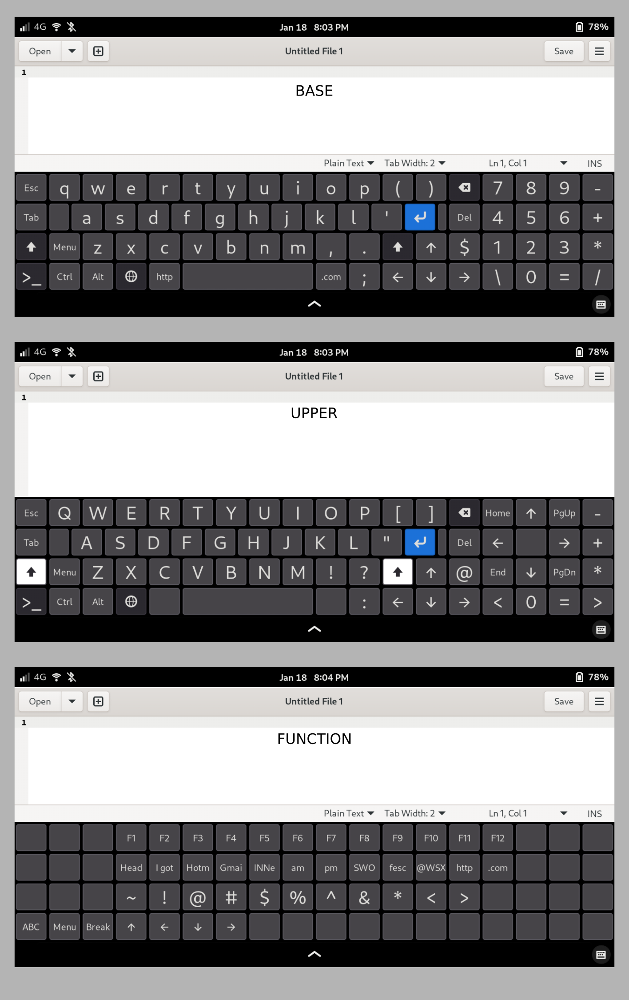

# Phosh-Squeekboard-Keyboard
Custom Phosh Squeekboard Keyboard Layout that looks like a US English 104 Keyboard layout. This needs to be use added locally because it has quick preset keys for text. 

## How to use
Make the ~/.local/share/squeekboard/keyboards/ directory  
Copy all these files to ~/.local/share/squeekboard/keyboards/   
File structure should look like:  
~/.local/share/squeekboard/keyboards/us.yaml  
~/.local/share/squeekboard/keyboards/number/us.yaml  
~/.local/share/squeekboard/keyboards/terminal/us.yaml  
From there it should get picked up by squeekboard automatically.  

Manual inputs  
Open the yaml files up and look for "M4" replace the text and label with your own strings.

## Screenshots
  

References
--------

- Squeekboard source
- https://gitlab.gnome.org/World/Phosh/squeekboard
- 
- creating layouts
- https://developer.puri.sm/projects/squeekboard/tutorial.html

