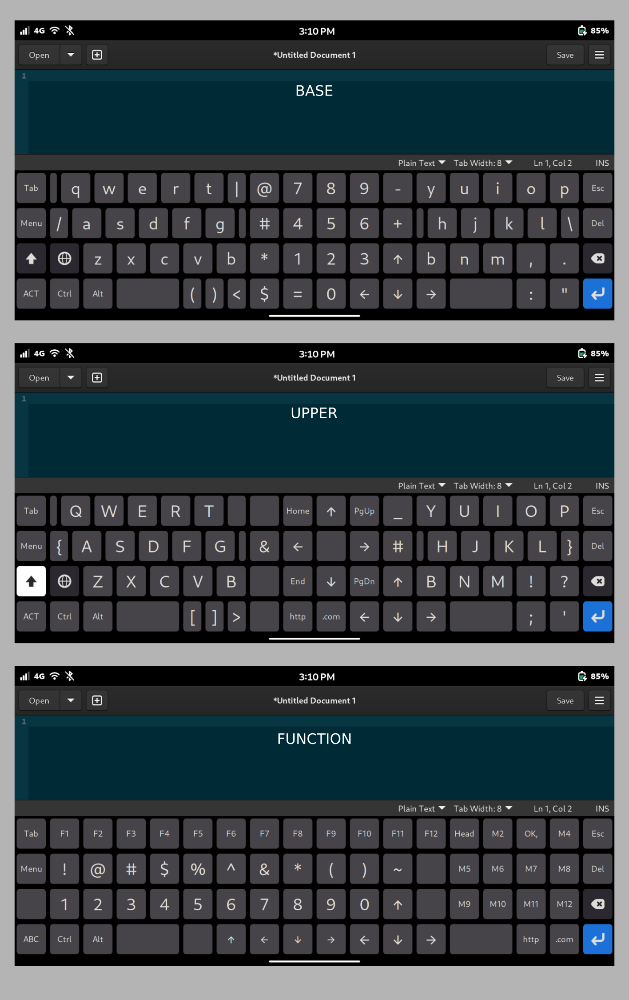

# Phosh-Squeekboard-Keyboard
Custom Phosh Squeekboard Keyboard Layout that looks like a US english 104 Keyboard layout. This needs to be use added locally because it has quick preset keys for text. 

How to use
--------

Copy all thse files to ~/.local/share/squeekboard/keyboards/

File structure should look like:

~/.local/share/squeekboard/keyboards/us.yaml

~/.local/share/squeekboard/keyboards/number/us.yaml

~/.local/share/squeekboard/keyboards/terminal/us.yaml

From there it should get picked up by squeekboard automatically.

Screenshots
--------

References
--------

- Squeekboard source
- https://gitlab.gnome.org/World/Phosh/squeekboard
- 
- creating layouts
- https://developer.puri.sm/projects/squeekboard/tutorial.html

